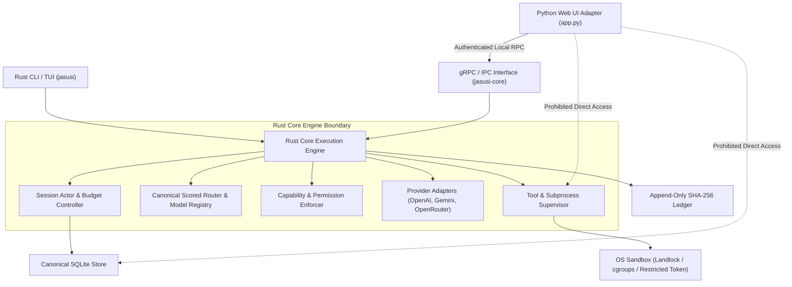

# ADR-001: Selection of Single Rust Execution Engine and Thin Python Web Adapter Architecture

* **Status:** Accepted (Phase 0 Governance Milestone G0)
* **Date:** 2026-07-24
* **Authors:** Security & System Architecture Board
* **Deciders:** Lead Systems Architect, Principal Security Engineer
* **Traceability:** F01 (Dual Python/Rust authority), F02, F03, F05, F09, F11, F13

---

## 1. Context and Problem Statement

The repository currently exhibits dual-authority architecture ("split-brain runtime"):
1. A Python runtime (`jasusi_cli/`) containing an legacy orchestrator, scored router, ChromaDB memory store, and direct subprocess/tool execution capability.
2. A Rust workspace (`rust/crates/`) containing a parallel CLI, Tokio runtime, actor framework, gRPC server (`jasusi-core`), sandbox abstractions, and SQLite audit ledger.

This dual implementation leads to severe architectural and security defects:
* Security enforcement policies (permissions, path traversal checks, sandbox constraints) are implemented independently in both languages, causing drift and bypass vulnerabilities.
* Web interfaces (`app.py`) invoke free-form, string-interpolated Python subprocesses (`python -c`), bypassing CLI argument parsing and permission checks.
* Provider streaming, token budgeting, session management, and transcript compaction are disjointed across runtimes.
* RPC endpoints in Rust return fabricated success stubs (`verified: true`, `success: true`) without performing back-end persistence or policy evaluation.

---

## 2. Decision Outcome

We formally select the **Single Rust Execution Engine** target model:

> **All model routing, permissions, tool execution, session state, memory persistence, token budgets, process sandboxing, and audit ledger semantics SHALL HAVE EXACTLY ONE AUTHORITATIVE IMPLEMENTATION IN RUST.**
> 
> **Python is retained exclusively as a thin, unprivileged, authenticated API and Web adapter.**

### System Boundary Architecture

---

## 3. Non-Negotiable Architecture Invariants

1. **Single Authority:** Exactly one active implementation for model routing, permissions, tool execution, session lifecycle, memory indexing, and provider adapters.
2. **Fail Closed:** Any unavailable authentication, unverified policy, failing sandbox, or illegal input denies execution.
3. **No False Success:** Unimplemented RPC endpoints return `grpc::Status::unimplemented()`. Unbacked state queries return typed errors. No stub response may synthesize fake operational success.
4. **Model Output is Untrusted Data:** LLM outputs must be parsed, validated, and structured into typed contracts. Raw LLM strings cannot directly become executable shell commands, unvalidated filesystem paths, or overwritten source files.
5. **Bounded Execution:** Every input stream, file upload, IPC buffer, child process, retry loop, token count, and SSE event has explicit time and size upper bounds.
6. **Cancellation Completeness:** Client disconnect or execution timeout immediately terminates and reaps the entire child process process group.
7. **Canonical Configuration:** Single configuration schema validated at startup, generating typed representations for Rust and Python interfaces.
8. **Transactional Mutation:** Source file edits use patch contracts applied atomically in isolated worktrees with automated rollback on validation failure.
9. **Evidence-Based Security Claims:** Terminology such as "sandboxed", "tamper-evident", "streaming", or "resumable" requires automated adversarial verification before inclusion in documentation.
10. **No Release by Test Count Alone:** Mandatory coverage, mutation testing, platform-specific contract tests, and negative security suites are required for release gates.

---

## 4. Consequences and Trade-offs

### Positive Consequences
* Eliminates split-brain routing and permission drift between CLI and Web interfaces.
* Establishes a single security perimeter around tool execution and file access.
* Provides deterministic, high-performance execution for streaming SSE and process sandboxing in Rust.
* Allows Python Web UI to remain simple, serving HTML/CSS assets and making IPC calls to the Rust daemon.

### Negative Consequences / Mitigations
* Requires deprecation and retirement of legacy Python tool executors, routers, and ChromaDB integrations.
* Requires formal gRPC client binding generation for Python to interact with `jasusi-core`.
* Temporary feature freeze on Python-side feature development during migration.

---

## 5. Compliance Verification

Gate G0 acceptance criteria require formal sign-off on ADR-001. Implementation progress across Phase 1–8 will be verified against the non-negotiable invariants specified in Section 3.
