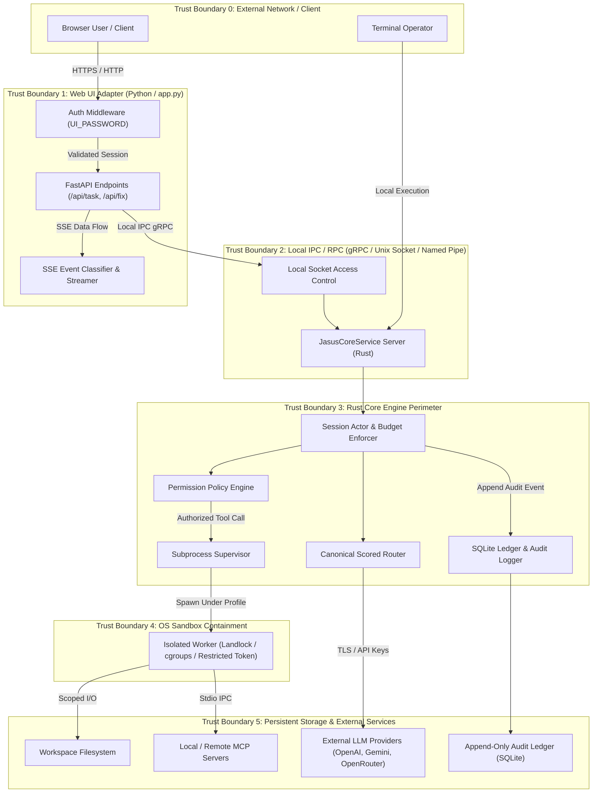

# Comprehensive STRIDE Threat Model & Data-Flow Analysis

* **Status:** Complete (Phase 0 Governance Milestone G0)
* **Date:** 2026-07-24
* **Scope:** Full Repository Threat Analysis & Security Perimeter Mapping

---

## 1. System Architecture Data-Flow Diagram (DFD)

---

## 2. STRIDE Threat Analysis Across 7 Core Surfaces

### Surface 1: Web Client and Authentication

* **Component Description:** FastAPI HTTP server (`app.py`), auth gate middleware, login headers (`x-ui-key`), query fallbacks (`?_key=`), CORS configuration.
* **STRIDE Threat Mapping:**

| Threat ID | Category | Threat Description | Existing Vulnerability / Gap | Mitigation Strategy & Target Phase |
|---|---|---|---|---|
| T1.1 | **Spoofing** | Unauthorized remote user accesses endpoints due to unauthenticated bind or weak password fallback. | Auth bypass if `UI_PASSWORD` unset; query string password leaks into server logs and browser history (F10). | Phase 1.2: Mandatory auth when binding non-loopback; move auth token from query params to `Authorization: Bearer` or `HttpOnly` cookie. |
| T1.2 | **Tampering** | CSRF or cross-site script alters task requests or wipes memory. | Wildcard CORS `allow_origins=["*"]` allows any origin to send requests (F10). | Phase 0/1.2: Restricted CORS allowlist (`127.0.0.1`/`localhost`); add Anti-CSRF token verification. |
| T1.3 | **Information Disclosure** | Sensitive API key health, quota state, or stack traces leaked to unauthenticated users. | `/api/status` endpoint exposes key presence and quota statistics without explicit authorization check when auth is misconfigured (F10). | Phase 1.2: Enforce strict auth gate across all `/api/` endpoints; sanitize error tracebacks. |
| T1.4 | **Denial of Service** | Unbounded stream creation or memory exhaustion via continuous SSE connections or uploaded files. | `await file.read()` loads full upload into RAM; no concurrency limits on stream handlers (F10). | Phase 1.2: Enforce file upload size limits (e.g. 10MB chunked streaming to disk); add request rate limiter & stream concurrency caps. |

---

### Surface 2: Python-to-Rust RPC Interface

* **Component Description:** gRPC connection between Python Web adapter and Rust `jasusi-core` gRPC server (`JasusCoreService`).
* **STRIDE Threat Mapping:**

| Threat ID | Category | Threat Description | Existing Vulnerability / Gap | Mitigation Strategy & Target Phase |
|---|---|---|---|---|
| T2.1 | **Spoofing** | Unauthenticated local process connects to gRPC socket and issues arbitrary execution commands. | gRPC server listens on unauthenticated TCP port without OS-level permission checks (F02). | Phase 1.1: Restrict local transport to Unix domain sockets / Windows named pipes with owner-only ACLs (`0600`). Require token auth for TCP. |
| T2.2 | **Tampering** | Injection of raw command strings via RPC payload manipulation. | String-interpolated `python -c` script generation in `app.py` bypassing structured protobuf contracts (F10). | Phase 1.2 & Phase 2: Eliminate `python -c` script construction entirely; mandate compiled gRPC protobuf client with strictly typed schema. |
| T2.3 | **Repudiation** | gRPC RPC endpoints return fake operational status, preventing reliable audit logging. | Stub RPC methods (`execute_tool`, `rollback_memory`) return fabricated success stubs (`verified: true`) without performing operations (F02). | Phase 1.1: Replace all stub handlers with `grpc::Status::unimplemented()` until real implementations are wired to audit ledger. |
| T2.4 | **Denial of Service** | Malformed protobuf message crashes gRPC parser or hangs async worker thread. | No message size limits or deserialization timeouts on gRPC receiver channel (F02). | Phase 1.1: Configure `max_receive_message_size` (4MB), set call deadlines, and handle protobuf parsing failures gracefully. |

---

### Surface 3: Provider Traffic and Credentials

* **Component Description:** HTTP clients sending prompts and receiving streaming responses from Anthropic, OpenAI, Google AI, and OpenRouter APIs.
* **STRIDE Threat Mapping:**

| Threat ID | Category | Threat Description | Existing Vulnerability / Gap | Mitigation Strategy & Target Phase |
|---|---|---|---|---|
| T3.1 | **Information Disclosure** | API keys leaked via environment variables, log output, subprocess parameters, or error traces. | Credentials present in cleartext in process environment and potentially serialized in diagnostic logs (F15). | Phase 1.3 & Phase 3: Implement `SecretSanitizer` across all logging sinks; store credentials in platform credential managers or encrypted files. |
| T3.2 | **Tampering** | Man-in-the-middle attack or provider endpoint spoofing alters LLM tokens or injects malicious tool calls. | Provider base URLs configurable without domain verification or TLS pin checks. | Phase 4: Enforce TLS 1.3 for all provider connections; validate provider endpoint certificates against system trust store. |
| T3.3 | **Denial of Service** | Out-of-control LLM output loops or infinite provider retries exhaust API quotas and financial budgets. | Disconnected turn counters and token compaction thresholds allow runaway provider calls (F09). | Phase 4: Enforce strict token budget limits per turn and per session; implement circuit breakers and jittered exponential backoff. |

---

### Surface 4: Model-Generated Tool Calls

* **Component Description:** Parsing model output into tool call structures (`ToolRequest`) and dispatching tool execution.
* **STRIDE Threat Mapping:**

| Threat ID | Category | Threat Description | Existing Vulnerability / Gap | Mitigation Strategy & Target Phase |
|---|---|---|---|---|
| T4.1 | **Elevation of Privilege** | Indirect prompt injection in fetched files or web content forces model to invoke dangerous tool calls. | Prompt instructions can trick LLM into issuing malicious `BashTool` commands (F04, F05). | Phase 3: Enforce rigid capability-based permission evaluation (`PermissionPolicy`) and OS-level sandboxing independent of LLM intent. |
| T4.2 | **Tampering** | Model output directly overwrites source code files with invalid markdown or unvalidated code snippets. | `run_fix` directly writes unvalidated model text blocks over source files without diff review or syntax validation (F06). | Phase 1.3 & Phase 5: Disable direct overwrite; require structured patch contracts, pre-flight syntax checks, diff display, and rollback tracking. |
| T4.3 | **Repudiation** | Tool execution performed without recorded authorization or audit trace. | Inconsistent logging between Python legacy tool executor and Rust audit ledger. | Phase 3 & Phase 6: All tool execution requests must emit signed, hash-chained entries into the `WormLedger` prior to execution. |

---

### Surface 5: Filesystem Access and Uploaded Files

* **Component Description:** File read/write tools, file fix upload endpoints (`/api/fix/stream`), project workspace boundaries.
* **STRIDE Threat Mapping:**

| Threat ID | Category | Threat Description | Existing Vulnerability / Gap | Mitigation Strategy & Target Phase |
|---|---|---|---|---|
| T5.1 | **Information Disclosure** | Path traversal attack via relative paths (`../../`), symlinks, or device paths reads arbitrary system files (`/etc/passwd`, `C:\Windows`). | Incomplete path normalization in upload endpoint and file read tools (F10). | Phase 1.2 & Phase 3: Canonicalize all paths against workspace root; reject absolute paths, `..`, symlink escapes, and UNC paths. |
| T5.2 | **Tampering** | Symlink race condition (TOCTOU) allows writing files outside workspace boundary. | File tools check path permissions before opening without atomic open flags or handle pin checks. | Phase 3: Use openat / path handle pinning, Landlock mount restrictions, and atomic file creation flags. |
| T5.3 | **Denial of Service** | Disk space exhaustion via arbitrary file upload floods or giant log files. | Upload files written to temporary directory without total disk storage limits (F10). | Phase 1.2: Enforce global temporary file size quotas, auto-cleanup hooks, and filesystem space checks. |

---

### Surface 6: Sessions, Memory, Logs, and Ledger Data

* **Component Description:** Transcript logging, ChromaDB vector storage, SQLite `WormLedger` audit database, session state files.
* **STRIDE Threat Mapping:**

| Threat ID | Category | Threat Description | Existing Vulnerability / Gap | Mitigation Strategy & Target Phase |
|---|---|---|---|---|
| T6.1 | **Tampering** | Adversary or rogue process alters past audit ledger records to conceal malicious tool execution. | Claims of "tamper-evident" ledger lack cryptographic signature chain verification across restarts (F16). | Phase 6: Implement HMAC / SHA-256 hash-chain verification with sequence enforcement and corruption detection on load. |
| T6.2 | **Information Disclosure** | Sensitive prompt history, code snippets, or API keys stored in plain text in session logs or vector DB. | Transcripts and ChromaDB files stored unencrypted in local directory (F15, F16). | Phase 1.3 & Phase 6: Remove tracked session transcripts from repository; add optional encryption-at-rest for session stores. |
| T6.3 | **Repudiation** | Session state loss during process crash leads to unrecorded operational history. | Session persistence disconnected from transaction boundary (F09). | Phase 4 & Phase 6: Write-ahead logging (WAL) for SQLite ledger; atomic session state commits on every event boundary. |

---

### Surface 7: MCP (Model Context Protocol) and Remote Execution

* **Component Description:** Integration with local and remote MCP servers via stdio transport or gRPC.
* **STRIDE Threat Mapping:**

| Threat ID | Category | Threat Description | Existing Vulnerability / Gap | Mitigation Strategy & Target Phase |
|---|---|---|---|---|
| T7.1 | **Elevation of Privilege** | Malicious or compromised MCP server executes arbitrary code on host system. | MCP stdio process spawning lacks OS sandbox boundary or restricted capability limits (F05). | Phase 3 & Phase 4: Enforce strict process sandboxing, environment redaction, and bounded lifecycle management for all MCP child processes. |
| T7.2 | **Denial of Service** | MCP server process hangs, leaks sub-processes, or consumes excessive CPU/RAM. | Child process timeouts do not kill full process group, leaving orphaned worker processes running (F08). | Phase 1.1 & Phase 4: Implement process group / job object management to ensure `kill_on_drop` and full process tree termination on timeout. |

---

## 3. Threat Model Review Sign-Off (Gate G0 Criteria)

This threat model has been formally reviewed and accepted by the Security Governance Board for Phase 0. All identified threats T1.1 through T7.2 map directly to finding IDs F01–F16 and are assigned for remediation across Phases 1 through 8.
